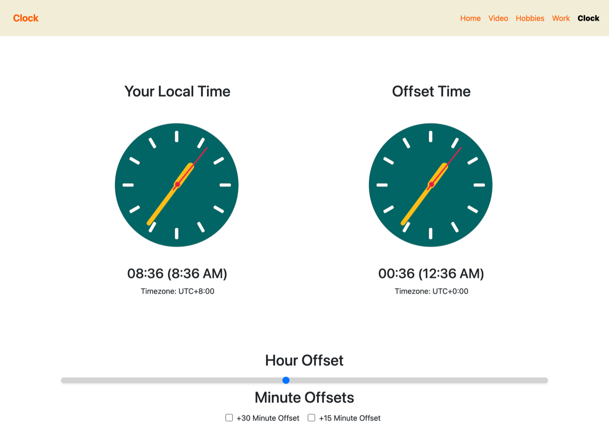
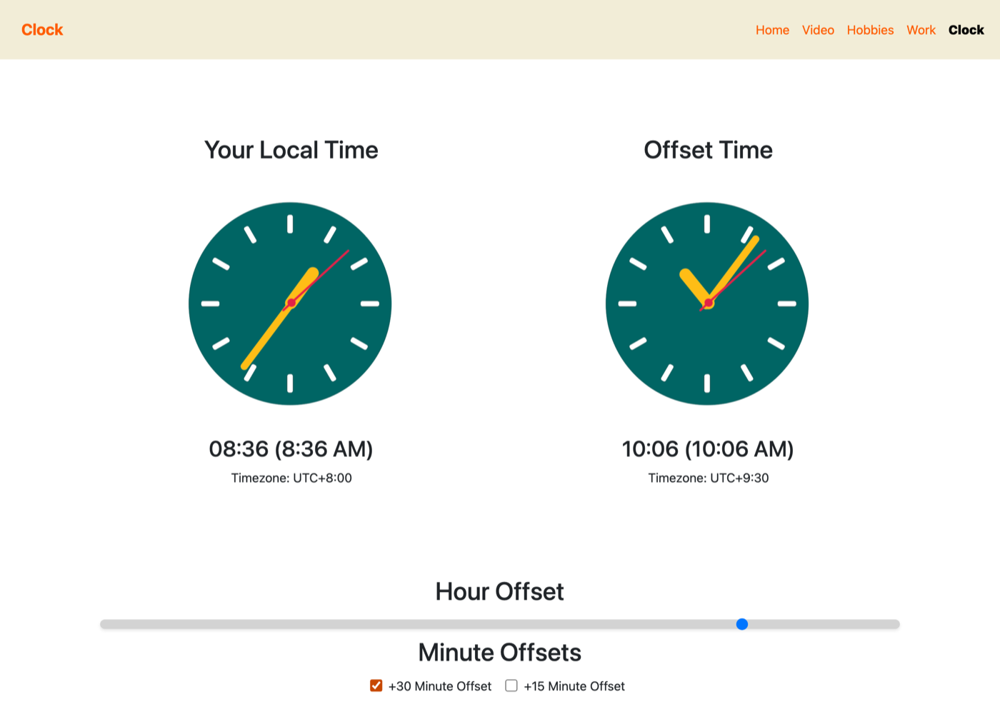
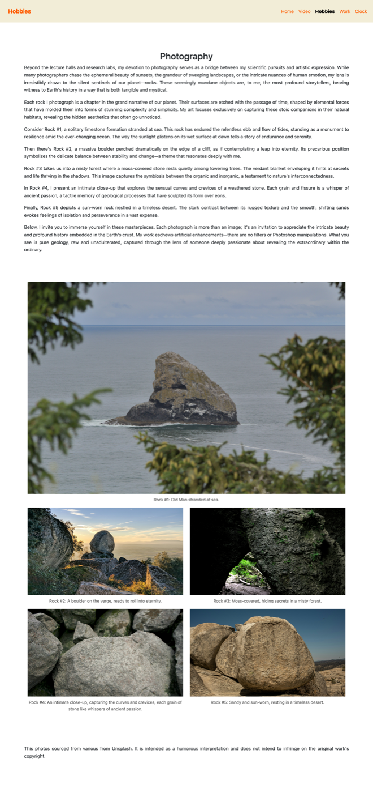
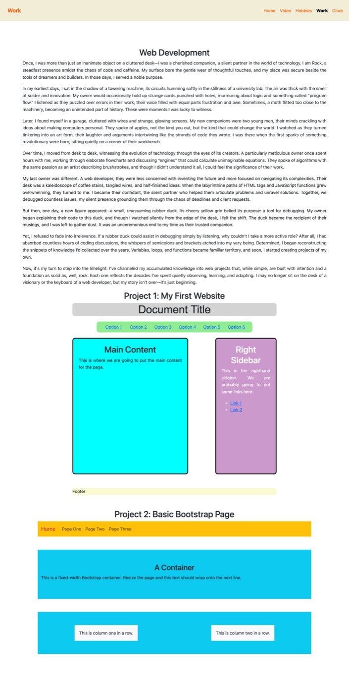

> [!WARNING]
> This is a university coursework site from November 2024, and I haven't touched it since I handed it in. It's a five-page joke portfolio written in the voice of a rock with a geology PhD, and the one piece of it that's a real program is the offset clock. Three things are broken: `index.html` is an empty stub, so the site actually starts at `home.html`; the left-hand clock draws its hands from UTC while printing your machine's local time underneath them; and the Work page's mobile menu won't open. All three are in [Known issues](#known-issues). I'm leaving them there, because what makes this worth keeping is the record of what I could build at the time.

<div align="center">


</div>

## About

The brief wanted a small multi-page site with some working JavaScript in it. I wrote the pages as a fake portfolio for Dr. Pebble-Anthony "Jimbob" Guzman Jr., a rock who earned a PhD in Geology, records Katy Perry covers, and got squeezed out of the web development market by rubber ducks. Hobbies is his rock photography, complete with artist's statement. Work is his professional portfolio, which is really two earlier layout exercises rendered inline on the page.

The clock is the part I'd still defend. Two faces run off a single 16ms timer: yours on the left, and on the right whatever offset you dial in, from -12 to +14 hours on the slider plus stackable +30 and +15 minute checkboxes. That range covers every offset in real use, including the 45-minute ones like Nepal's UTC+5:45. Push the offset past midnight and a small superscript `+1` or `-1` appears beside the time.

- Two analog faces driven by one `setInterval` at 16ms, so the second hands sweep continuously rather than stepping once a second
- Hour offset slider spanning -12 to +14, written as a 0 to 26 range input with 12 subtracted from the value
- `+30` and `+15` minute checkboxes that stack, which is how you reach the `:45` offsets
- Day rollover marker: a superscript `+1` or `-1` next to the offset time when it crosses midnight in either direction
- Timezone label under each face, read from the browser for yours and calculated for the offset one
- Five pages sharing one Bootstrap navbar, each rendering its own entry bold and unclickable
- An HTML5 `<video>` element on the Video page, playing a 21MB mp4 committed straight into the repo
- Both earlier coursework exercises embedded inside the Work page, each carrying its own stylesheet

## Tech stack

| Layer | Technology | Why it's here |
|---|---|---|
| Markup | HTML5 | Five hand-written pages. No templating, so the navbar is copy-pasted into each one |
| Styling | CSS3 | `style.css` holds the site: navbar, typography, the clock faces and the custom range slider. `project1.css` is scoped to one embedded exercise |
| Behavior | Vanilla JavaScript (ES6) | `clock.js`, 78 lines, the only script in the repo that does anything. Template literals and `const`, no framework |
| UI framework | Bootstrap 5.3.3 (CDN) | Navbar with its mobile collapse, and the grid that sits the two clock faces side by side |
| Clock face | Four PNGs | `clockface.png` as a CSS background, three hand images rotated with `transform: rotate()` |
| Media | HTML5 `<video>` | Plays `videos/californiagirls.mp4` from disk. No player library |
| Tooling | None | No package manager, no bundler, no `package.json`. Files on disk, opened in a browser |

## Screenshots

The clock at rest, offset slider centered. Both faces are drawing the identical time, which is the bug: the left one reads `08:36` underneath hands pointing at 00:36, because the hand math uses UTC and the text below it uses your machine's timezone. The machine I built this on ran at UTC+0, where those two readings are the same number, so I never saw it.



The same page after I dragged the slider to +9 and ticked the +30 checkbox. The right-hand face is the one that moved, to 10:06, and its label underneath switched to UTC+9:30. The left face stays where it was.



The home page, and the rock in question.


The Hobbies gallery. Rock #1 at the top runs full-bleed at its own aspect ratio while the four below it are cropped to a uniform 300px. That's the `.hobbies-image-tall` bug rather than a layout choice.



The Work page, with both earlier exercises rendered inside it. The cyan-and-purple float layout is the one headed Project 1, the yellow Bootstrap navbar is Project 2.



## Getting started

### Prerequisites

- A browser supporting `accent-color`, which styles the two offset checkboxes orange. That's Chrome 93+, Firefox 92+ or Safari 15.4+. Anywhere older the checkboxes render in the default blue and everything else still works. I tested on Chromium 153
- An internet connection, because Bootstrap loads from jsDelivr and isn't vendored. Without it the navbar loses its layout and collapse behavior, though the clock itself keeps working
- Optional: Python 3, if you'd rather serve the folder than open files directly. Verified on Python 3.9.6

You don't need Node.js or npm. There's no `package.json` in here and nothing to build.

### Installation

```bash
git clone https://github.com/saturncity/misc-uni-imm-coursework.git
cd misc-uni-imm-coursework
```

Nothing to install. The repo has no dependencies to fetch.

### Configuration

None. It reads no environment variables and talks to no API or database.

### Running

Open `home.html`, not `index.html`. The file named `index.html` is an empty stub that renders a blank page. Double-click `home.html`, or from a terminal:

```bash
open home.html        # macOS
xdg-open home.html    # Linux
start home.html       # Windows
```

Everything works over `file://`, the clock included. To serve the folder over HTTP instead, which is closer to how it'd deploy:

```bash
python3 -m http.server 8000
```

Then go to <http://localhost:8000/home.html>. Note the filename on the end: the bare <http://localhost:8000> lands on the empty `index.html`.

## Project structure

```
misc-uni-imm-coursework/
├── index.html        # Empty stub. Not the entry point, see Known issues
├── home.html         # The actual entry point: Jimbob's bio
├── clock.html        # The offset clock: two faces, slider, two checkboxes
├── clock.js          # One 16ms tick drives both faces. The only working script here
├── video.html        # HTML5 video player for the cover
├── hobby.html        # Rock photography gallery and artist's statement
├── work.html         # Portfolio page with both earlier exercises embedded inline
├── style.css         # Site-wide: navbar, type, clock faces, custom range slider
├── project1.css      # Scoped to the float layout embedded in work.html
├── project2.css      # Empty file, still linked from work.html
├── script.js         # Empty file, linked from nothing
├── images/           # Clock face and hands, the Jimbob portrait, five rock photos
├── videos/           # californiagirls.mp4, 21MB, committed directly into the repo
└── docs/
    ├── assets/       # The screenshots above
    └── README.old.md # The TODO list this README replaced
```

## Known issues

What's wrong with it. I'm documenting rather than fixing, since the value here is the snapshot.

- **`index.html` is an empty stub.** It's the default IntelliJ template, `<title>Title</title>` and an empty body, and I never deleted it. Open the folder root or point a static host at it and you get a blank page. The site starts at `home.html`. Renaming `home.html` to `index.html` and repointing the five navbars would fix it.
- **The local clock's hands show UTC, not your local time.** In `clock.js`, `updateClock()` builds `s`, `m` and `h` from `getUTCSeconds()`, `getUTCMinutes()` and `getUTCHours()`, then rotates the left-hand face with them. The text under that face comes from `now.getHours()`, which is local. So outside UTC the analog and digital readings disagree by your whole offset, which you can see in the first screenshot above. I built and submitted this on a machine sitting at UTC+0, where the two agree exactly, which is why it got past me. The fix is one line: use the local getters for the left face's hand math.
- **The Work page's mobile menu is dead.** Every other page loads `bootstrap.bundle.min.js`, but `work.html` doesn't, so its hamburger button has no handler attached. Below 576px the nav collapses and then won't reopen. I checked this by clicking the toggler at 480px wide on both pages: `home.html` adds the `show` class, `work.html` doesn't change at all.
- **Project 2's demo navbar toggles the site navbar.** Inside `work.html`, the embedded exercise has its own collapse wrapper with `id="collapsibleNavbar2"`, but its button still carries `data-bs-target="#collapsibleNavbar"`, pointing at the page's real navbar. Two elements on that page share that target. It's masked right now only because the Bootstrap JS is missing there too.
- **`.hobbies-image-tall` doesn't exist.** `hobby.html` puts that class on Rock #1, and no stylesheet defines it, so the image falls through to the global `img { width: 100% }` rule and runs full-bleed. `style.css` does define `.img-tall` at 900px, which I'm fairly sure is what I meant, and nothing uses it. Renaming one or the other fixes it.
- **`#offsetDaySup` stops existing after the first frame.** `clock.js` grabs it into a `const` at the top, then the first tick overwrites the whole `<h3>` with `offsetTimeDisplay.innerHTML`, destroying the element that variable points at. The day rollover marker still renders, because it's rebuilt inside that same template string, so the `const` is just a dead reference.
- **Dead arithmetic in the offset timezone label.** The line computing `totalOffsetHours` adds `Math.floor(adjustedMinutes / 60)`, but `adjustedMinutes` was already reduced with `% 60` a few lines above, so that term is always 0. The label happens to come out right anyway.
- **Two empty files.** `project2.css` is 0 bytes and still linked from `work.html`; `script.js` is 0 bytes and linked from nowhere.
- **`.img-fluid` is dead too.** `style.css` overrides it with `object-fit: cover`, but no element in the repo carries that class, so the rule never applies to anything.
- **The original TODO list never finished.** No page has a footer, and the colors were never reconciled: the navbar and body share `#F2EDD7` but the embedded exercises keep their own loud palettes. That list is preserved in [`docs/README.old.md`](docs/README.old.md).
- **The media isn't mine.** `videos/californiagirls.mp4` is a cover of a Katy Perry song and the five rock photos came off Unsplash. Both carry parody and attribution notes on the pages themselves, which was fine for a marked submission to one tutor. Worth thinking about before this repo goes public.

## Contributing

Not taking contributions. It's a graded submission from 2024 and changing it would defeat the point of keeping it. Fork it if the offset clock is useful to you, and read the Known issues first if you do.

## License

No license file. That means default copyright applies and nobody else has permission to reuse this. The third-party video and photos noted above would need sorting out separately from any license I picked.
